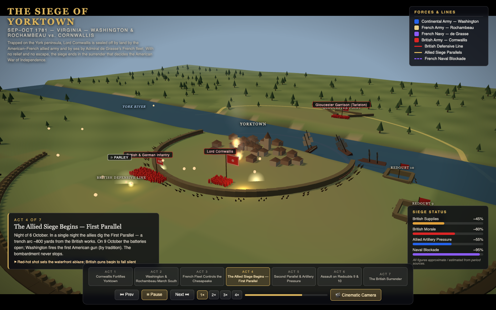
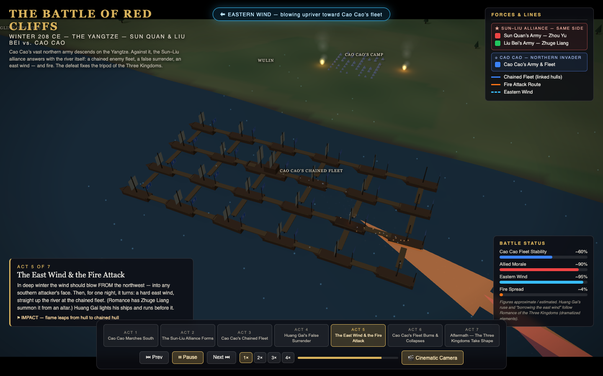

# Interactive 3D Battle Documentaries

Three single-file Three.js battle reconstructions, styled as TV history
specials. No build step — each battle is one HTML file with CDN imports.

| Battle | Live demo |
|---|---|
| ⚔ The Battle of Alesia — 52 BCE | https://yitachen.github.io/battle-of-alesia-3d/ |
| 🇺🇸⚜ The Siege of Yorktown — 1781 | https://yitachen.github.io/battle-of-alesia-3d/yorktown.html |
| 🔥🌊 The Battle of Red Cliffs — 208 CE | https://yitachen.github.io/battle-of-alesia-3d/redcliffs.html |

---

# The Battle of Alesia — 52 BCE

**Live demo: https://yitachen.github.io/battle-of-alesia-3d/**

An interactive 3D reconstruction of the Battle of Alesia (52 BCE), styled as a
TV history special / war documentary / game battle-replay hybrid. Julius Caesar
besieges Vercingetorix inside the hilltop oppidum of Alesia — then is himself
surrounded when a massive Gallic relief army arrives, leaving the Romans
fighting back-to-back between two enemy forces inside their own double ring of
fortifications.

Built as a **single `index.html`** with [Three.js](https://threejs.org/) loaded
from CDN (no build step): OrbitControls for free camera, CSS2DRenderer for map
and unit labels.

## Features

- **3D battlefield** — procedural terrain with the Alesia plateau, Mont Réa,
  the Plain of Laumes, the Ose & Oserain river valleys, forests and hills
- **Roman siege works** — progressive construction of the inner siege line
  (circumvallation) and outer defense line (contravallation): palisades,
  watchtowers, trenches, stakes, four Roman camps incl. Caesar's Camp
- **Three factions** with instanced soldier formations, waving standards and
  clickable info cards: Romans (blue, Julius Caesar), Gallic defenders (red,
  Vercingetorix), Gallic relief army (green)
- **Six-act interactive timeline** with autoplay, prev/next, and per-act
  cinematic camera paths (plus a free-camera mode):
  1. Vercingetorix Retreats to Alesia
  2. Caesar Begins the Siege
  3. Roman Engineering Works
  4. The Gallic Relief Army Arrives
  5. The Double Assault
  6. Collapse and Surrender
- **Period-appropriate effects** — arrow/javelin volleys, ballista bolts from
  the towers, pulsing assault-direction arrows, dust clouds, night fires and
  smoke, dusk lighting for the final assault
- **Documentary UI** — title block, faction legend, act narration panel,
  event ticker, and live status bars (Roman Discipline, Gallic Morale,
  Alesia Supplies, Siege Pressure)

## Controls

| Control | Action |
|---|---|
| Act buttons / ⏮ ⏭ | Jump between chapters |
| ▶ ⏸ / Space | Pause / resume the entire show (progress, troops, effects, camera) |
| 1× 2× 3× 4× / keys `1`–`4` | Playback speed |
| 🎬 / `C` | Toggle Cinematic ↔ Free camera (free camera works even while paused) |
| Mouse drag / wheel | Rotate / zoom (free camera) |
| Click a unit or label | Show its info card |
| `?act=N` / `?act=N&t=S` URL params | Deep-link straight into act N (optionally S seconds in) |

## Historical note

Troop figures follow ancient sources (chiefly Caesar's *De Bello Gallico*) and
are marked **approximate / estimated** in the UI; the ancient claim of a
250,000-man relief army is widely considered exaggerated. The terrain is
stylized for legibility, not archaeologically exact, but follows the historical
logic: the town on a central plateau, the Roman double line around it, and the
relief army arriving across the western plain.

---

# The Siege of Yorktown — 1781

**Live demo: https://yitachen.github.io/battle-of-alesia-3d/yorktown.html**

The decisive siege of the American War of Independence (`yorktown.html`,
same single-file / CDN approach). Lord Cornwallis is trapped on the York
peninsula — besieged by land by Washington's and Rochambeau's allied army,
and sealed off by sea by Admiral de Grasse's French fleet.

## Features

- **3D coastal battlefield** — the York River, Chesapeake Bay, Yorktown on
  its bluff, Gloucester Point across the river, marshy creeks, farmland
  siege ground; all key locations labelled
- **Four factions** with flags, leader labels and clickable info cards:
  Continental Army (blue, Washington, Hamilton, Knox), French Army
  (white/gold, Rochambeau, Lauzun), French Navy (purple, de Grasse),
  British Army (red, Cornwallis, Tarleton)
- **Land + sea encirclement** — allied siege parallels dug progressively on
  land, and a French blockade line of square-rigged ships of the line with a
  dashed exclusion arc sealing the river mouth
- **Seven-act timeline**: fortification → allied march south → naval
  blockade → First Parallel → Second Parallel → night assault on
  Redoubts 9 & 10 → surrender
- **18th-century siege effects** — cannon and mortar arcs with muzzle
  flashes and impact bursts, naval broadsides, musket volleys, burning
  buildings and ships, night assault with bayonet-charge arrows
- **Live siege status** — British Supplies, British Morale, Allied
  Artillery Pressure, Naval Blockade

Controls are identical to Alesia (see table above). Figures are marked
**approximate / estimated**; the geography is stylized but preserves the
strategic structure: the army pinned against the river, the allies in a
land arc, the fleet closing the sea.

---

# The Battle of Red Cliffs — 208 CE

**Live demo: https://yitachen.github.io/battle-of-alesia-3d/redcliffs.html**

The naval battle that fixed the Three Kingdoms (`redcliffs.html`, same
single-file / CDN approach). Cao Cao's northern armada anchors on the
Yangtze off Wulin; the outnumbered Sun-Liu alliance answers with a chained
enemy fleet, a false surrender, an east wind — and fire.

## Features

- **3D Yangtze battlefield** — the river, the reddish Red Cliffs bluff,
  Wulin and Cao Cao's north-bank camp, the allied anchorage downstream,
  the Huarong retreat road; all key locations labelled
- **Three factions** with flags, leader labels and clickable info cards:
  Cao Cao (blue), Sun Quan / Zhou Yu / Huang Gai (red),
  Liu Bei / Zhuge Liang (green) — alliance grouping shown in the legend
- **The chained fleet** — a 6×4 grid of warships visibly linked hull-to-hull
  with chains and boarding planks
- **Ship damage state machine** — every warship transitions
  Normal → Ignited → Burning → Charred → Destroyed with charring hulls,
  burning sails, collapsing masts, listing wrecks; click any ship to see
  its current state
- **Chain-reaction fire attack** — fire ships run before the wind, and the
  blaze spreads outward through the linked grid; a Fire Spread bar tracks it
- **The east wind** — a particle stream over the river, a pulsing wind chip,
  map arrows and an Eastern Wind status bar (the altar scene is flagged as a
  *Romance of the Three Kingdoms* dramatization)
- **Seven-act timeline** from the southern march to the Three Kingdoms
  aftermath, with a colour-coded victory banner (red + green allies defeat
  blue)

Controls are identical to the other battles. Figures are marked
**approximate / estimated**; dramatized elements (Huang Gai's ruse,
"borrowing the east wind") are labelled as such in the UI.
