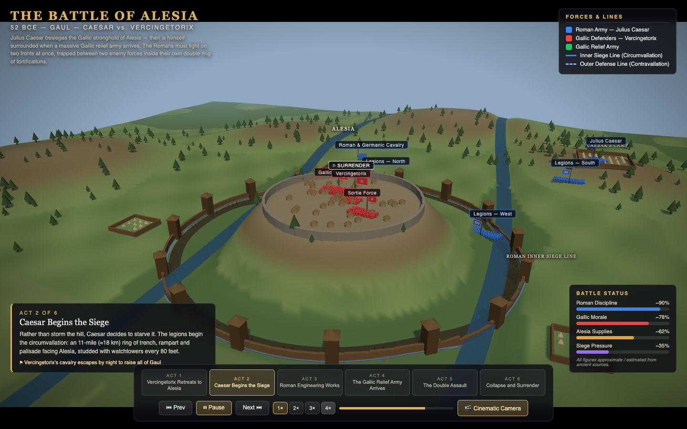

# The Battle of Alesia — 52 BCE | Interactive 3D Battle Documentary

**Live demo: https://yitachen.github.io/battle-of-alesia-3d/**

An interactive 3D reconstruction of the Battle of Alesia (52 BCE), styled as a
TV history special / war documentary / game battle-replay hybrid. Julius Caesar
besieges Vercingetorix inside the hilltop oppidum of Alesia — then is himself
surrounded when a massive Gallic relief army arrives, leaving the Romans
fighting back-to-back between two enemy forces inside their own double ring of
fortifications.

Built as a **single `index.html`** with [Three.js](https://threejs.org/) loaded
from CDN (no build step): OrbitControls for free camera, CSS2DRenderer for map
and unit labels.

## Features

- **3D battlefield** — procedural terrain with the Alesia plateau, Mont Réa,
  the Plain of Laumes, the Ose & Oserain river valleys, forests and hills
- **Roman siege works** — progressive construction of the inner siege line
  (circumvallation) and outer defense line (contravallation): palisades,
  watchtowers, trenches, stakes, four Roman camps incl. Caesar's Camp
- **Three factions** with instanced soldier formations, waving standards and
  clickable info cards: Romans (blue, Julius Caesar), Gallic defenders (red,
  Vercingetorix), Gallic relief army (green)
- **Six-act interactive timeline** with autoplay, prev/next, and per-act
  cinematic camera paths (plus a free-camera mode):
  1. Vercingetorix Retreats to Alesia
  2. Caesar Begins the Siege
  3. Roman Engineering Works
  4. The Gallic Relief Army Arrives
  5. The Double Assault
  6. Collapse and Surrender
- **Period-appropriate effects** — arrow/javelin volleys, ballista bolts from
  the towers, pulsing assault-direction arrows, dust clouds, night fires and
  smoke, dusk lighting for the final assault
- **Documentary UI** — title block, faction legend, act narration panel,
  event ticker, and live status bars (Roman Discipline, Gallic Morale,
  Alesia Supplies, Siege Pressure)

## Controls

| Control | Action |
|---|---|
| Act buttons / ⏮ ⏭ | Jump between chapters |
| ▶ ⏸ / Space | Pause / resume the entire show (progress, troops, effects, camera) |
| 1× 2× 3× 4× / keys `1`–`4` | Playback speed |
| 🎬 / `C` | Toggle Cinematic ↔ Free camera (free camera works even while paused) |
| Mouse drag / wheel | Rotate / zoom (free camera) |
| Click a unit or label | Show its info card |
| `?act=N` / `?act=N&t=S` URL params | Deep-link straight into act N (optionally S seconds in) |

## Historical note

Troop figures follow ancient sources (chiefly Caesar's *De Bello Gallico*) and
are marked **approximate / estimated** in the UI; the ancient claim of a
250,000-man relief army is widely considered exaggerated. The terrain is
stylized for legibility, not archaeologically exact, but follows the historical
logic: the town on a central plateau, the Roman double line around it, and the
relief army arriving across the western plain.
